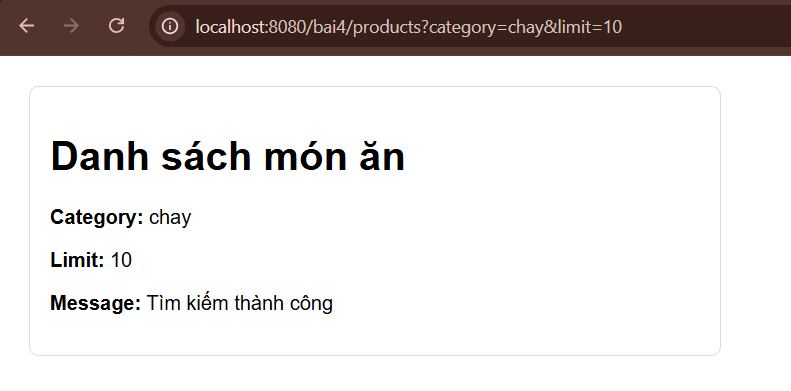
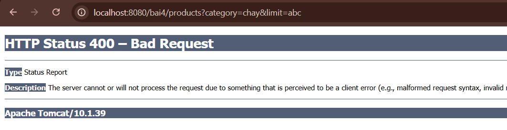

Sơ đồ I/O (Data Flow)
🔹 URL đầu vào:
/bai4/products?category=chay&limit=10
🔹 Luồng xử lý:
[Client (Browser)]
↓
(Request gửi lên URL với Query String)
↓
[Controller - Bai4Controller]
- Nhận dữ liệu từ URL:
  @RequestParam("category") → category
  @RequestParam("limit") → limit
        ↓
- Đẩy dữ liệu vào ModelMap:
  key: "category" → value: category
  key: "limit" → value: limit
  key: "message" → value: "Tìm kiếm thành công"
        ↓
- Trả về View:
  "productList"
        ↓
[View - productList.jsp]
- Nhận dữ liệu từ ModelMap:
  ${category}
  ${limit}
  ${message}
        ↓
[Hiển thị lên trình duyệt]
